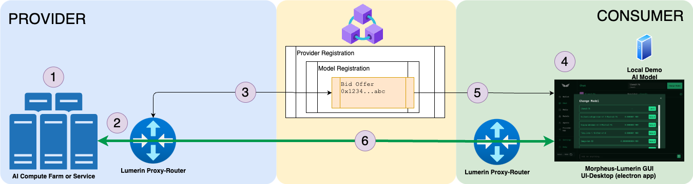

# Morpheus Lumerin Node

The purpose of this software is to enable interaction with distributed, decentralized LLMs on the Morpheus network through a desktop chat experience.

The steps listed below are for both the Consumer and Provider to get started with the Morpheus Lumerin Node. As the software is developed, both onboarding & configuration of the provider and consumer roles will be simplified, automated and more transparent to the end user.

# **NOTE: ARBITRUM SEPOLIA TESTNET**

**Components that are included in this repository are:**
* Local `Llama.cpp` and tinyllama model to run locally for demonstration purposes only
* Lumerin `proxy-router` is a background process that monitors sepcific blockchain contract events, 
manages secure sessions between consumers and providers and routes prompts and responses between them
* Lumerin `ui-desktop` is the front end UI to interact with LLMs and the Morpheus network via the proxy-router as a consumer

## Tokens and Contract Information 
* Morpheus saMOR Token: `0xc1664f994fd3991f98ae944bc16b9aed673ef5fd` 
* Lumerin Morpheus Smart Contract(Diamond Contract) : `0x8e19288d908b2d9F8D7C539c74C899808AC3dE45`
    * Interact with the Morpheus Contract: https://louper.dev/diamond/0x8e19288d908b2d9F8D7C539c74C899808AC3dE45?network=arbitrumSepolia#write
* Blockchain Explorer: `https://sepolia.arbiscan.io/`
* Swagger API: `http://localhost:8082/swagger/index.html`(or http://server_ip:8082/swagger/index.html)

## Funds
* **WALLET:** For testing as a provider or consumer, you will need both `saMOR` and `saETH` tokens in your wallet. You should be able to get either of these from the usual Sepolia Arbitrum testnet faucets.
    * `saMOR` is the token used to pay for the model provider staking and consumer usage
    * `saETH` is the token used to pay for the gas fees on the network  


# Provider Hosting (Local LLM to offer, Proxy-Router running as background/service): 

## Assumptions: 
* Your AI model has been configured, started and made available to the proxy-router server via a private endpoint (IP:PORT or DNS:PORT) eg: `http://mycoolaimodel.domain.com:8080`
    * Optional
        * You can use the provided `llama.cpp` and `tinyllama` model to test locally
        * If your local model is listening on a different port locally, you will need to modify the `OPENAI_BASE_URL` in the .env file to match the correct port
* You have an existing funded wallet with saMOR and saETH and also have the `private key` for the wallet (this will be needed for the .env file configuration)
* You have created an Alchemy or Infura free account and have a private API key for the Arbitrum Sepolia testnet (wss://arb-sepolia.g.alchemy.com/v2/<your_private_alchemy_api_key>)
* Your proxy-router must have a publicly accessible endpoint for the provider (ip:port or fqdn:port no protocol) eg: `mycoolmornode.domain.com:3333` - this will be used when creating the provider on the blockchain

## Installation & Configuration Steps:
1. Download latest release for your operating system: https://github.com/Lumerin-protocol/Morpheus-Lumerin-Node/releases
   
   `curl -L https://github.com/Lumerin-protocol/Morpheus-Lumerin-Node/releases/download/250b20f/mor-launch-250b20f-ubuntu-x64.zip --output morpheus-lumerin-node.zip`
   
2. Extract the zip to a local folder (examples)
   
   `unzip morpheus-lumerin-node.zip`
   
   `cd morpheus-lumerin-node`

3.  Edit the `.env` file following the guide below [proxy-router .ENV Variables](#proxy-router-env-variables) 
    
    `nano .env`

4. After save .env file as guide, run this command in morpheus-lumerin-node directory 

    `root@my-server:~/morpheus-lumerin-node# ./mor-launch`

5. Validating Steps:
   - Once the proxy-router is running, you can navigate to the Swagger API Interface (http://server_ip:8082/swagger/index.html as example) to validate that the proxy-router is running and listening for blockchain events
   - You can also check the logs in the `./data` directory for any errors or issues that may have occurred during startup
   - Once validated, you can move on and create your provider, model and bid on the blockchain [provider-offer.md](docs/provider-offer.md)

6. **(OPTIONAL)** - External Provider or Pass through 
    * In some cases you will want to leverage external or existing AI Providers in the network via their own, private API
    * Dependencies: 
        * `model-config.json` file in the releases version directory
        * .env file for proxy-router must also be updated to include `MODELS_CONFIG_PATH=./models-config.json`
    * Once your provider is up and running, deploy a new model and model bid via the diamond contract (you will need the `model_ID` for the configuration)
    * Edit the model-config.json to the following json format ... with 
    * The JSON ID will be the ModelID that you created above, modelName, apiTYpe, apiURL and apiKey are from the external provider and specific to their offered models 
    * Once the model-config.json file is updated, the morpheus node will need to be restarted to pick up the new configuration
    * Example model-config.json file for external providers
    * `0xb2c8a6b2c1d9ed7f0e9a3b4c2d6e5f14f9b8c3a7e5d6a1a0b9c7d8e4f30f4a7b` // ModelID that you created using api `http://server.ip:8082/swagger/index.html#/models/post_blockchain_models`
```
#models-config.json 
{
    "0x4b5d6c2d3e4f5a6b7c8de7f89a0b19e07f4a6e1f2c3a3c28d9d5e6": {
        "modelName": "v1-5-specialmodel.modelversion [externalmodel]",
        "apiType": "provider_api_type",
        "apiUrl": "https://api.externalmodel.com/v1/xyz/generate",
        "apiKey": "api-key-from-external-provider"
    },
    "0xb2c8a6b2c1d9ed7f0e9a3b4c2d6e5f14f9b8c3a7e5d6a1a0b9c7d8e4f30f4a7b": {
        "modelName": "Architex AI Chat",
        "apiType": "openai",
        "apiUrl": "http://localhost:8080/v1",
    }
}
```
7. Security
    - Proxy API port(8082) should be denied because it has private key and it can set all enironment for your provider.

        `sudo ufw deny from any to any port 8082`

        `sudo ufw enable`

        `sudo ufw status`

        `sudo service iptables save`


        Only allow for you(Your IP)

        `sudo ufw allow from <Your IP Address> to any port 8082`
        
    - Allow 3333 PORT for provider

        `ufw allow 3333`

        `ufw reload`

        `netstat -tlnp | grep 3333`

----------------
### proxy-router .ENV Variables 
Key Values in the .env file are (there are others, but these are primarly responsible for connecting to the blockchain, the provider AI model and listening for incoming traffic): 
- `WALLET_PRIVATE_KEY=` 
    - Private Key from your wallet needed for the proxy-router to sign transactions and respond to provided prompts (this is why the proxy router must be secured and the API endpoint protected)
- `ETH_NODE_ADDRESS=wss://arb-sepolia.g.alchemy.com/v2/<your_private_alchemy_api_key>` or `ETH_NODE_ADDRESS=wss://arbitrum-sepolia.infura.io/ws/v3/<your_private_infura_api_key>`
    - Ethereum Node Address for the Arbitrum blockchain (via Alchemy or Infura)
    - This websocket (wss) address is key for the proxy-router to listen and post to the blockchain
    - We recommend using your own private ETH Node Address for better performance (free account setup via Alchemy or Infura)
       
    

- `DIAMOND_CONTRACT_ADDRESS=0x8e19288d908b2d9F8D7C539c74C899808AC3dE45`
    - This is the key Lumerin Smart Contract (currently Sepolia Arbitrum testnet)
    - This is the address of the smart contract that the proxy-router will interact with to post providers, models & bids 
    - This address will change as the smart-contract is updated and for mainnet contract interaction 
- `MOR_TOKEN_ADDRESS=0xc1664f994fd3991f98ae944bc16b9aed673ef5fd`
    - This is the Morpheus Token (saMOR) address for Sepolia Arbitrum testnet
    - This address will be different for mainnet token
- `WEB_ADDRESS=0.0.0.0:8082` 
    - This is the local listenting port for your proxy-router API (Swagger) interface
    - Based on your local needs, this may need to change (8082 is default)
- `WEB_PUBLIC_URL=localhost:8082` 
    - If you have or will be exposing your API interface to a local, PRIVATE (or VPN) network, you can change this to the DNS name or IP and port where the API will be available. The default is just on the local machine (localhost)
    - The PORT must be the same as in the `WEB_ADDRESS` setting             
- `OPENAI_BASE_URL=http://localhost:8080/v1` 
    - This is where the proxy-router should send OpenAI compatible requests to the provider model. 
    - By default (and included in the Morpheus-Lumerin software releases) this is set to `http://localhost:8080/v1` for the included llama.cpp model
    - In a real-world scenario, this would be the IP address and port of the provider model server or server farm that is hosting the AI model separately from the proxy-router 
- `PROXY_STORAGE_PATH=./data/`
    - This is the path where the proxy-router will store logs and other data
    - This path should be writable by the user running the proxy-router software
- `MODELS_CONFIG_PATH=` 
    - location of the models-config.json file that contains the models that the proxy-router will be providing. 
    - it has the capability to also (via private API) call external providers models (like Prodia)
- `PROXY_ADDRESS=0.0.0.0:3333` 
    - This is the local listening port for the proxy-router to receive prompts and inference requests from the consumer nodes
    - This is the port that the consumer nodes will send prompts to and should be available publicly and via the provider definition setup on the blockchain
  

**Finally you can test and open session with your provider model(Architex AI Chat) in Consumer chat**

# Consumer Installation Steps:

`https://github.com/MorpheusAIs/Morpheus-Lumerin-Node/blob/main/docs/04-consumer-setup.md`

